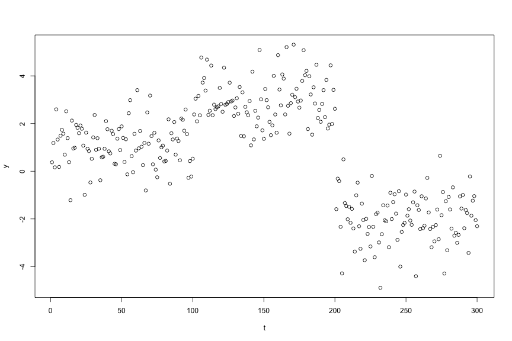

Advanced tutorial
----

In this tutorial, we demonstrate advanced use of the ```ChangepointInference``` package. 
Installation instructions are provided [here](software.html). 

First load the package: 


require(ChangepointInference)




## Loading required package: ChangepointInference


To illustrate the software, we generate a synthetic dataset according to 

$$
\begin{align}
Y_{t} = \mu_{t} + \epsilon_{t}, \quad \epsilon_{t} \overset{\text{iid}}{\sim} \mathrm{N}(0, \sigma^{2}), \quad t=1,\ldots,T,
\end{align}
$$
and assume that $\mu_1,\ldots,\mu_T$ is  piecewise constant, in the sense that  $\mu_{\tau_j+1}=\mu_{\tau_j + 2 } = \ldots = \mu_{\tau_{j+1}}$, $\mu_{\tau_{j+1}} \neq \mu_{\tau_{j+1}+1}$, for $j=0,\ldots,K-1$, where $0 = \tau_{0} < \tau_{1} < \ldots < \tau_{K} < \tau_{K+1} = T$, and where $\tau_1,\ldots,\tau_K$ represent the true changepoints.  



set.seed(1)
mu <- rep(c(1, 3, -2), each = 100)
dat <- mu + rnorm(length(mu))
plot(dat, cex = 1, ylab = "y", xlab = "t")





#### Changepoint estimation

To estimate changepoints via $\ell_0$ segmentation, we use functional recursions . In this section, we briefly describe these recursions and illustrate how this information can be extracted from our software. 

Let $\mathrm{Cost}(y_{1:s}; u)$ be the cost of segmenting $y_{1:s}$ with $\mu_{s} = u$. Then $\mathrm{Cost}(y_{1:s}; u)$ can be efficiently computed: At the first timepoint, we have $\mathrm{Cost}(y_{1}; u) = \frac12(y_{1} - u)^{2}$; for any $s > 1$ and for all $u$, 
$$
\begin{align}
\mathrm{Cost}(y_{1:s}; u) = \min\left\{ \mathrm{Cost}(y_{1:(s-1)};u), \min_{u'}{\mathrm{Cost}(y_{1:(s-1)};u')} + \lambda	\right\} + \frac12(y_{s} - u)^{2}.
\end{align}
$$


For each $u$, this recursion encapsulates two possibilities: (i) there is no changepoint at  the $(s-1)$st timepoint, and the optimal cost is equal to the previous cost plus the cost of a new data point, $\mathrm{Cost}(y_{1:(s-1)};u) + \frac12(y_{s} - u)^{2}$; (ii) there is a changepoint at the $(s-1)$st timepoint, and the optimal cost is equal to the optimal cost of segmenting up to $s-1$ plus the penalty for adding a changepoint at $s-1$ plus the cost of a new data point,  $\min_{u'}{\mathrm{Cost}(y_{1:(s-1)};u')} + \lambda	+ \frac12(y_{s} - u)^{2}$. 

Setting ```functional_pruning_out = TRUE``` allows us to examine  $\mathrm{Cost}(y_{1:s}; u)$. The following plots $\mathrm{Cost}(y_{1:300}; u)$. Colors represent the most recent changepoint associated with optimal cost at each $u$. 


lam <- 4
fit <- changepoint_estimates(dat, "L0", lam, functional_pruning_out = TRUE)
p <- plot(fit, s = 300)



To manually access the cost functions use ```fit$piecewise_square_losses```. Since $\mathrm{Cost}(y_{1:s}; u)$ is piecewise quadratic, we represent each component through its coefficients ```(square, linear, constant)``` over domain ```(min_mean, max_mean)```. Furthermore, we store the most recent changepoint ```data_i``` for each region ```(min_mean, max_mean)```. 

For example, the plot above is created by filtering the dataframe to $s = 300$. We see that this cost function is defined over five regions with most recent changepoints at ```200, 287, 294, 299```. 



fit$piecewise_square_losses[fit$piecewise_square_losses$s == 300, ]




##      square     linear constant   min_mean   max_mean prev_last_mean
## 1617    0.5   2.305815 152.9045 -4.8889207 -2.2512053      -1.966938
## 1618   50.0 197.032646 340.4123 -2.2512053 -1.7139801       2.962192
## 1619    6.5  21.534563 167.4032 -1.7139801 -1.6503894      -2.017219
## 1620    3.0   8.722768 155.7920 -1.6503894 -0.5818996      -2.003297
## 1621    0.5   2.305815 152.9045 -0.5818996  5.3079784      -1.966938
##      data_i   s
## 1617    299 300
## 1618    200 300
## 1619    287 300
## 1620    294 300
## 1621    299 300



#### Changepoint inference

The conditioning set $\mathcal{S}$ can be extracted for fixed and adaptive $\nu$s by setting ```return_conditioning_sets = TRUE```. See Section 3 of our paper  for additional details. 

For example, 



h <- 10
K <- 2
fit_inference <- changepoint_inference(dat, 'BS-fixed', K, window_size = h, sig = 1, return_conditioning_sets = TRUE)


The conditioning set for each estimated changepoint can be accessed through



fit_inference$conditioning_sets




## [[1]]
##     min_mean   max_mean contained
## 1       -Inf -63.819416         1
## 2 -63.819416  -1.555879         1
## 3  -1.555879  33.068620         0
## 4  33.068620        Inf         1
## 
## [[2]]
##    min_mean  max_mean contained
## 1      -Inf -8.835202         1
## 2 -8.835202  2.720512         0
## 3  2.720512 13.128808         1
## 4 13.128808       Inf         1

Each row is a subset of $\mathbb{R}$ defined as ```(min_mean, max_mean)```. This region is in $\mathcal{S}$ if ```contained = 1```. 

There are simple plotting tools to visualize these sets: 



plot(fit_inference, thj = fit_inference$change_pts[1])



In the case of inference with $\ell_0$ segmentation, it is also possible to view the cost of segmenting the data as a function of $\phi$, that is, 

$$
\begin{align}
\mathrm{Cost(\phi)} := \underset{\mu\in\mathbb{R}^{T}}{\mathrm{min}}{\frac12 \sum_{t = 1}^{T} (y_t'(\phi) - \mu_{t})^{2} + \lambda \sum_{t = 
2}^{T} 1_{(\mu_{t} \neq \mu_{t-1})}}.
\end{align}
$$



fit_inference <- changepoint_inference(dat, 'L0-fixed', lam, window_size = h, sig = 1, return_conditioning_sets = TRUE)
plot(fit_inference, thj = fit_inference$change_pts[1])



References
----


