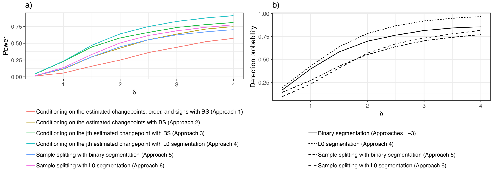

# Testing for a change in mean after changepoint detection 

Overview
-----

Through tutorials, this website illustrates our framework to test the null hypothesis that there is no change in mean 
near changepoints estimated via L0 and binary segmentation; as described in our paper .

Technical details
----

We consider the changepoint model
$$
\begin{align}
Y_{t} = \mu_{t} + \epsilon_{t}, \quad \epsilon_{t} \overset{\text{iid}}{\sim} \mathrm{N}(0, \sigma^{2}), \quad t=1,\ldots,T,
\end{align}
$$
and assume that $\mu_1,\ldots,\mu_T$ is  piecewise constant, in the sense that  $\mu_{\tau_j+1}=\mu_{\tau_j + 2 } = \ldots = \mu_{\tau_{j+1}}$, $\mu_{\tau_{j+1}} \neq \mu_{\tau_{j+1}+1}$, for $j=0,\ldots,K-1$, where $0 = \tau_{0} < \tau_{1} < \ldots < \tau_{K} < \tau_{K+1} = T$, and where $\tau_1,\ldots,\tau_K$ represent the true  changepoints.   

#### Changepoint estimation 
We estimate changepoints via $\ell_0$ or binary segmentation based on
noisy observations $y_t$. 

**$\ell_0$ segmentation**: In the case of $\ell_0$ segmentation ,
changepoints are estimated by solving the optimization problem

$$
\begin{align}
\underset{\mu\in\mathbb{R}^{T}}{\mathrm{minimize}}{\frac12 \sum_{t = 1}^{T} (y_{t} - \mu_{t})^{2} + \lambda \sum_{t = 
2}^{T} 1_{(\mu_{t} \neq \mu_{t-1})}},
\end{align}
$$
for the global optimum. Our estimates for the changepoints correspond to the
breakpoints of $\hat{\mu}_1, \ldots, \hat{\mu}_T$. This results in estimated changepoints $\mathcal{M}(y) 
=\\{\hat{\tau}_1, \ldots,\hat{\tau}_K\\}$.

**Binary segmentation**: In the case of binary segmentation , changepoints are 
estimated by
 recursively
maximizing the CUSUM statistic: 
$$
\begin{align}
g^{\top}_{(s, \tau, e)}y := \sqrt{\frac{1}{\frac{1}{|e - \tau|} + \frac{1}{|\tau+1-s|}}}(\bar{y}_{(\tau+1):e} - \bar{y}_{s:\tau}),
\end{align}
$$
defined through a contrast $g_{(s, \tau, e)}\in\mathbb{R}^{T}$, which summarizes the evidence for a change at $\tau$ in 
the data $y_{s:e}:= (y_{s}, \ldots, y_{e})$ by the difference in the empirical mean of the data before and after 
$\tau$ (normalized to have the same variance for all $\tau$). The first estimated changepoint maximizes the
CUSUM statistic over all possible locations. Subsequent changepoints are
estimated at the location that maximizes the CUSUM statistic of the data when
regions between previously estimated changepoints are considered. This
results in estimated changepoints $\mathcal{M}(y) =\\{\hat{\tau}_1, \ldots,\hat{\tau}_K\\}$, the order each 
changepoint 
entered the model $\mathcal{O}(y)$, and
the sign of the change in mean due to each changepoint $\Delta(y)$. 

#### Inference for a change in mean near an estimated changepoint 

To quantify the uncertainty of these estimates, we test the null hypothesis that there is no change in mean 
near an estimated changepoint. In particular, we test the null hypothesis 
$$
\begin{align}
H_{0}: \nu^{\top}\mu = 0 \text { versus } H_{1}:  \nu^{\top}\mu \neq 0,
\label{eq:hyp-test}
\end{align}
$$
for a T-vector contrast $\nu$ defined based on the definition of near. We define fixed and adaptive defintions of 
*near*. In the fixed window case, we define near based on a window $h>0$ around $\hat{\tau}_j$
$$
\begin{align}
\nu_t = 
\begin{cases}
0 & \text{ if } t \leq \hat{\tau}_j - h \text { or } t > \hat{\tau}_j + h, \\
\frac{1}{h} & \text { if } \hat{\tau}_j - h < t \leq \hat{\tau}_j, \\
-\frac{1}{h} & \text { if }   \hat{\tau}_j < t \leq \hat{\tau}_j + h,
\end{cases}                                            
\label{eq:nu-window}
\end{align}
$$
whereas, in the adaptive case, near is defined based on the neighboring changepoints 
$$
\begin{align}
\nu_t = 
\begin{cases}
0 &  t \leq \hat\tau_{j-1}, t > \hat\tau_{j+1}, \\
\frac{1}{\hat\tau_{j } - \hat\tau_{j-1}} &  \hat\tau_{j-1} < t \leq \hat\tau_j, \\
-\frac{1}{\hat\tau_{j+1}-\hat\tau_j} & \hat\tau_{j} < t \leq \hat\tau_{j+1}.
\end{cases}
\end{align}
$$

Our framework allows us to efficiently compute $p$-values based on adaptive and
fixed test statistics and for different conditioning sets. Let $\nu^\top y$ be the observed test statistic and let 
$\phi = \nu^\top Y$. In our paper , we show that the $p$-value corresponding
to the test $H_0: \nu^\top \mu = 0$ can be written as
$$
Pr(|\phi| \geq |\nu^\top y| | \phi \in \mathcal{S})
$$
for a conditioning set $\mathcal{S}$.

In what follows, 
$$
\begin{align}
y'(\phi) = y - \frac{\nu \nu^{\top}y}{||\nu||_{2}^{2}}  + \frac{\nu \phi}{||\nu||_{2}^{2}}
\end{align}
$$
is a perturbation of the
observed data $y$. (See Theorem 1 of our paper   for additional
                    details.)
Our software computes $p$-values for the following test statistics and
conditioning sets:

* Type = 'L0-fixed': 
$$
\text{Pr}(|\phi| \geq |\nu^\top y| | \hat{\tau}_j \in \mathcal{M}(y'(\phi))),
$$
for fixed $\nu$.

* Type = 'BS-fixed': 
$$
\text{Pr}(|\phi| \geq |\nu^\top y| | \hat{\tau}_j \in \mathcal{M}(y'(\phi))),
$$
for fixed $\nu$.

* Type = 'BS-adaptive-M-O-D':
$$
\text{Pr}(|\phi| \geq |\nu^\top y| | \mathcal{M}(y) = \mathcal{M}(y'(\phi)), \mathcal{O}(y) = \mathcal{O}(y'(\phi)), 
\Delta(y) =
 \Delta(y'
(\phi)),
$$
for adaptive $\nu$.

* Type = 'BS-adaptive-M-O':
$$
\text{Pr}(|\phi| \geq |\nu^\top y| | \mathcal{M}(y) = \mathcal{M}(y'(\phi)), \mathcal{O}(y) = \mathcal{O}(y'(\phi))),
$$
for adaptive $\nu$. 

* Type = 'BS-adaptive-M':
$$
\text{Pr}(|\phi| \geq |\nu^\top y| | \mathcal{M}(y) = \mathcal{M}(y'(\phi))), 
$$
for adaptive $\nu$.

Since $Y_t$ is Gaussian, $\phi | \mathcal{S}$ is a Gaussian truncated to $\mathcal{S}$.
Therefore, to calculate each of these probabilities, we must determine
$\mathcal{S}$. See Sections 4 and 5 of our paper  for a description of the 
algorithms we use
 to efficiently 
calculate $\mathcal{S}$ exactly. See the [tutorial](tutorial.html) page for a demo of this software. 

Funding
----

Sean Jewell received funding from the Natural Sciences and Engineering Research Council of Canada. This work was partially supported by Engineering and Physical Sciences Research Council Grant EP/N031938/1 to Paul Fearnhead, and NSF CAREER DMS-1252624, NIH grants DP5OD009145, R01DA047869, and R01EB026908, and a Simons Investigator Award in Mathematical Modeling of Living Systems to Daniela Witten.

References 
----


