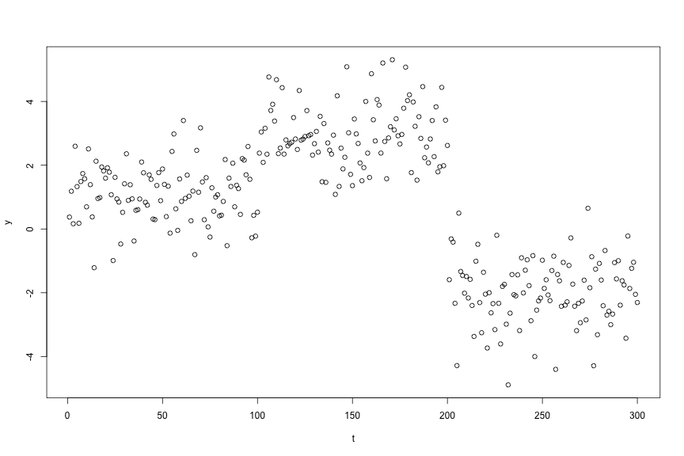

Basic tutorial
----

In this tutorial, we demonstrate basic use of the ```ChangepointInference``` package. 
Installation instructions are provided [here](software.html). 

First load the package: 


require(ChangepointInference)




## Loading required package: ChangepointInference


To illustrate the software, we generate a synthetic dataset according to 

$$
\begin{align}
Y_{t} = \mu_{t} + \epsilon_{t}, \quad \epsilon_{t} \overset{\text{iid}}{\sim} \mathrm{N}(0, \sigma^{2}), \quad t=1,\ldots,T,
\end{align}
$$
and assume that $\mu_1,\ldots,\mu_T$ is  piecewise constant, in the sense that  $\mu_{\tau_j+1}=\mu_{\tau_j + 2 } = \ldots = \mu_{\tau_{j+1}}$, $\mu_{\tau_{j+1}} \neq \mu_{\tau_{j+1}+1}$, for $j=0,\ldots,K-1$, where $0 = \tau_{0} < \tau_{1} < \ldots < \tau_{K} < \tau_{K+1} = T$, and where $\tau_1,\ldots,\tau_K$ represent the true changepoints.  



set.seed(1)
mu <- rep(c(1, 3, -2), each = 100)
dat <- mu + rnorm(length(mu))
plot(dat, cex = 1, ylab = "y", xlab = "t")




#### Changepoint estimation

* Estimate changepoints using $\ell_0$ segmentation and with tuning parameter $\lambda = 4$:


lam <- 4
fit <- changepoint_estimates(dat, "L0", lam)
print(fit)




## 
##  Output: 
## Type 					 L0 
## Number of estimated changepoints 	 2 
## 
##  Settings: 
## Data length 				 300 
## Tuning parameter 			 4


The ```fit``` object contains model fit information:


str(fit)




## List of 10
##  $ estimated_means        : num [1:300] 1.11 1.11 1.11 1.11 1.11 ...
##  $ dat                    : num [1:300] 0.374 1.184 0.164 2.595 1.33 ...
##  $ type                   : chr "L0"
##  $ change_pts             : num [1:2] 100 200
##  $ call                   : language changepoint_estimates(dat = dat, type = "L0", tuning_parameter = lam)
##  $ tuning_parameter       : num 4
##  $ cost                   : num [1:300] 0 0.164 0.29 1.822 1.847 ...
##  $ n_intervals            : int [1:300] 1 3 3 3 4 4 4 3 4 4 ...
##  $ end_vec                : num [1:300] 200 200 200 200 200 200 200 200 200 200 ...
##  $ piecewise_square_losses: NULL
##  - attr(*, "class")= chr "ChangepointInference_L0_estimated_changes"


Importantly, the estimated changepoints are 


fit$change_pts




## [1] 100 200


* Estimate changepoints using binary segmentation with $K = 2$ changepoints:



K <- 2
fit <- changepoint_estimates(dat, "BS", K)
print(fit)




## 
##  Output: 
## Type 					 BS 
## Number of estimated changepoints 	 2 
## 
##  Settings: 
## Data length 				 300


The ```fit``` object contains model fit information:


str(fit)




## List of 8
##  $ dat               : num [1:300] 0.374 1.184 0.164 2.595 1.33 ...
##  $ type              : chr "BS"
##  $ change_pts        : num [1:2] 100 200
##  $ estimated_means   : num [1:300] 1.11 1.11 1.11 1.11 1.11 ...
##  $ ordered_change_pts: num [1:2] 200 100
##  $ change_pt_signs   : num [1:2] -1 1
##  $ call              : language changepoint_estimates(dat = dat, type = "BS", tuning_parameter = K)
##  $ tuning_parameter  : num 2
##  - attr(*, "class")= chr "ChangepointInference_BS_estimated_changes"


Importantly the sorted changepoints, the order changepoints were estimated, and the sign of the change in mean due to a changepoint (in same order as ```fit$ordered_change_pts```) are:


fit$change_pts




## [1] 100 200




fit$ordered_change_pts




## [1] 200 100




fit$change_pt_signs




## [1] -1  1


In particular, we note that in this example, the first changepoint is estimated at time point $200$ and at this point the sign of the change in mean is negative. This is expected as the mean of $y_{201:300}$ is less than the mean of $y_{1:200}$.  


#### Changepoint Inference

In this section we demonstrate how to use our software to obtain $p$-values for the following test statistics and conditioning sets. For the fixed window tests, we take the window size $h = 10$. 

* Type = 'L0-fixed': 
    $$
    \text{Pr}(|\phi| \geq |\nu^\top y| | \hat{\tau}_j \in \mathcal{M}(y'(\phi))),
    $$
    for fixed $\nu$.
    
    
    
    h <- 10
    fit_inference <- changepoint_inference(dat, 'L0-fixed', lam, window_size = h, sig = 1)
    knitr::kable(data.frame(estimated_changepoints = fit_inference$change_pts, pvals = fit_inference$pvals))
    
    
    
    
    | estimated_changepoints|    pvals|
    |----------------------:|--------:|
    |                    100| 0.001308|
    |                    200| 0.000000|


* Type = 'BS-fixed': 
    $$
    \text{Pr}(|\phi| \geq |\nu^\top y| | \hat{\tau}_j \in \mathcal{M}(y'(\phi))),
    $$
    for fixed $\nu$.
    
    
    
    fit_inference <- changepoint_inference(dat, 'BS-fixed', K, window_size = h, sig = 1)
    knitr::kable(data.frame(estimated_changepoints = fit_inference$change_pts, pvals = fit_inference$pvals))
    
    
    
    
    | estimated_changepoints|     pvals|
    |----------------------:|---------:|
    |                    100| 0.0011517|
    |                    200| 0.0000000|

* Type = 'BS-adaptive-M-O-D':
    $$
    \text{Pr}(|\phi| \geq |\nu^\top y| | \mathcal{M}(y) = \mathcal{M}(y'(\phi)), \mathcal{O}(y) = \mathcal{O}(y'(\phi)), 
    \Delta(y) =
     \Delta(y'
    (\phi)),
    $$
    for adaptive $\nu$.
    
    
    
    fit_inference <- changepoint_inference(dat, 'BS-adaptive-M-O-D', K, sig = 1)
    knitr::kable(data.frame(estimated_changepoints = fit_inference$change_pts, pvals = fit_inference$pvals))
    
    
    
    
    | estimated_changepoints| pvals|
    |----------------------:|-----:|
    |                    100|     0|
    |                    200|     0|

* Type = 'BS-adaptive-M-O':
    $$
    \text{Pr}(|\phi| \geq |\nu^\top y| | \mathcal{M}(y) = \mathcal{M}(y'(\phi)), \mathcal{O}(y) = \mathcal{O}(y'(\phi))),
    $$
    for adaptive $\nu$. 
    
    
    
    fit_inference <- changepoint_inference(dat, 'BS-adaptive-M-O', K, sig = 1)
    knitr::kable(data.frame(estimated_changepoints = fit_inference$change_pts, pvals = fit_inference$pvals))
    
    
    
    
    | estimated_changepoints| pvals|
    |----------------------:|-----:|
    |                    100|     0|
    |                    200|     0|

* Type = 'BS-adaptive-M':
    $$
    \text{Pr}(|\phi| \geq |\nu^\top y| | \mathcal{M}(y) = \mathcal{M}(y'(\phi))), 
    $$
    for adaptive $\nu$.
    
    
    
    fit_inference <- changepoint_inference(dat, 'BS-adaptive-M', K, sig = 1)
    knitr::kable(data.frame(estimated_changepoints = fit_inference$change_pts, pvals = fit_inference$pvals))
    
    
    
    
    | estimated_changepoints| pvals|
    |----------------------:|-----:|
    |                    100|     0|
    |                    200|     0|
